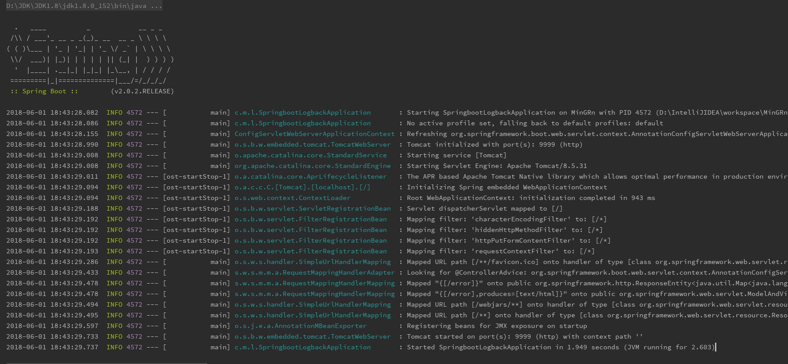

# SpringBoot 集成 LogBack框架

## 前言

Spring-Boot 作为微服务应用，默认集成 `logback` 日志框架。
 `logback`  是log4j框架的作者开发的新一代日志框架，它效率更高、能够适应诸多的运行环境，同时天然支持SLF4J。

  **默认logback日志打印效果图**



 从上图可以看到，日志输出内容元素如下

  - 时间日期 ：精确到毫秒
  - 日志级别 ：ERROR, WARN, INFO, DEBUG or TRACE
  - 进程ID
  - 分隔符 ：`---` 标识实际日志的开始
  - 线程名 ：方括号括起来（可能会截断控制台输出
  - Logger名 ：通常使用源代码的类名

*正如官网所说*：
Assuming the configuration files logback-test.xml or logback.xml are not present, logback will default to invoking BasicConfigurator which will set up a minimal configuration. This minimal configuration consists of a ConsoleAppender attached to the root logger. The output is formatted using a PatternLayoutEncoder set to the pattern %d{HH:mm:ss.SSS} [%thread] %-5level %logger{36} - %msg%n. Moreover, by default the root logger is assigned the DEBUG level.

## 创建 logback.xml


Spting-Boot 默认集成的 `logback` 虽然打印些日志信息，但是不够友好。满足不了我们日常开发需求。因此，我们可以在g根目录下创建 `logback.xml`  或 `logback-spring.xml` 文件，进行自定义配置

In a Spring Boot application, you can specify a Logback XML configuration file as logback.xml or logback-spring.xml in the project classpath. The Spring Boot team however recommends using the -spring variant for your logging configuration,   logback-spring.xml is preferred over  logback.xml. If you use the standard logback.xml configuration, Spring Boot may not be able to completely control log initialization.

Here is the code of the `logback-spring.xml` file


Sping-Boot 默认集成的 `logback`打印的日志样式个人觉得比较喜欢，而且默认打印的日志虽然不足以满足我们日常开发需要。但是我们可以直接在其基础上做些补充修改就能做到我们想要的日志输出，况且如果我们直接自定义日志输出的话想在控制台又想对不同的信息输出不同的颜色信息在进行定义的话也完全是脱裤子放弃多此一举不是？更何况默认Spring-Boot默认就做了这些开箱即用操作，所以我们直接引用进来即可！

笔者使用的 SpringBoot 开发版本为 `2.0.2.REALEASE` 版本，所以直接找到 `spring-boot-2.0.2.REALEASE` 依赖包。可以看到该依赖包下 `org.springframework.boot` 包级目录有许多默认配置依赖包类


当然，这里主要是看 `logging` 包，在该包中有个 `logback` 包，这里这里面放的就是默认 `logback` 日志配置文件。


其中主要有四个 `xml` 配置文件，我在可以就在我们创建的 `logback-spring.xml` 配置文件中引入 `base.xml` 配置文件。

```xml
<configuration>
	<include resource="org/springframework/boot/logging/logback/base.xml" />
</configuration>
```

现在我们重新启动项目就会发现打印的日志信息跟没创建自定义日志配置文件效果是一毛一样。就是因为 `springboot` 默认配置 `logback` 就是该配置文件。

现在在来看下 `base.xml` 配置文件中都是些什么。

```xml
<included>
	<include resource="org/springframework/boot/logging/logback/defaults.xml" />
	<property name="LOG_FILE" value="${LOG_FILE:-${LOG_PATH:-${LOG_TEMP:-${java.io.tmpdir:-/tmp}}}/spring.log}"/>
	<include resource="org/springframework/boot/logging/logback/console-appender.xml" />
	<include resource="org/springframework/boot/logging/logback/file-appender.xml" />
	<root level="INFO">
		<appender-ref ref="CONSOLE" />
		<appender-ref ref="FILE" />
	</root>
</included>
```

 其中最惹人瞩目的就是三个 `<include>`

> - `defaults.xml`
> - `console-appender.xml`：控制台输出日志信息
> - `file-appender.xml`：日志文件存储

所以，若是不直接引用 `base.xml` 配置文件，引用另外三个配置文件作用是相同的。建议单独引用文件，且只引用`defaults.xml` 和 `console-appender.xml`。因为多个app部署同一环境下可能会导致日志输出权限问题。

## 基本示例(仅做参考)

```xml
<configuration debug="true">

	<include resource="org/springframework/boot/logging/logback/defaults.xml" />
	<include resource="org/springframework/boot/logging/logback/console-appender.xml" />

	<property name="APP_NAME" value="Logback"/>
	<property name="APP_HOME" value="/home/logback"/>
	<property name="LOG_HOME_PATH" value="${APP_HOME}/logs"/>
	<property name="DEBUG_LOG_FILE" value="${LOG_HOME_PATH}/debug/${APP_NAME}_debug" />

	<appender name="DEBUG_FILE" class="ch.qos.logback.core.rolling.RollingFileAppender">
		<encoder>
			<pattern>${FILE_LOG_PATTERN}</pattern>
		</encoder>

		<rollingPolicy class="ch.qos.logback.core.rolling.TimeBasedRollingPolicy">
			<FileNamePattern>${DEBUG_LOG_FILE}.%d{yyyy-MM-dd}.log</FileNamePattern>
			<MaxHistory>60</MaxHistory>
		</rollingPolicy>

		<filter class="ch.qos.logback.classic.filter.LevelFilter">
			<level>DEBUG</level>
			<onMatch>ACCEPT</onMatch>
			<onMismatch>DENY</onMismatch>
		</filter>
	</appender>
	<root level="INFO">
		<appender-ref ref="DEBUG_FILE" />
	</root>

	<logger name="com.mingrn.logback" level="DEBUG">
		<appender-ref ref="DEBUG_FILE"/>
	</logger>

	<logger name="com.uhope.rl.logback.repository" level="DEBUG" />
</configuration>
```
