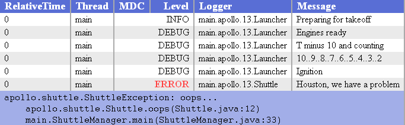

# 生成HTML日志文件

[生成HTML日志文件官网说明](https://logback.qos.ch/manual/layouts.html#ClassicHTMLLayout)

到目前为止，规则符看了，自定义规则你也会了，日志文件也生成了。但是，仅仅这些就完了？你有没有想过将日志生成HTML文件？看看，笔者就知道汝心动了，生成HTML有什么好处就不说了，直接开整！

先看下效果：



表列的内容是在转换模式的帮助下指定的。因此，你可以完全控制表的内容和格式。可以选择并显示任何转换器模式的组合知道的。

在使用规则符生成HTML文件与之前有个例外，就是不能使用空格或更一般的字符将规则符分开！

在之前的栗子中，都是在 `appender` 组件中使用 `encoder`编码器标签将直接将规则符 `pattern` 包裹起来，这里也是一样，不过要加一层 `layout`。直接看栗子：

```xml
<configuration debug="true">
  <appender name="FILE" class="ch.qos.logback.core.FileAppender">
    <encoder class="ch.qos.logback.core.encoder.LayoutWrappingEncoder">
      <layout class="ch.qos.logback.classic.html.HTMLLayout">
        <pattern>%relative%thread%mdc%level%logger%msg</pattern>
      </layout>
    </encoder>
    <file>test.html</file>
  </appender>

  <root level="DEBUG">
    <appender-ref ref="FILE" />
  </root>
</configuration>
```

这样，就会生成一个叫 `test` 的 html 文件！

>**注意：** 在生成的HTML 文件中如果通过 `%em` 转换符记录堆栈信息的话，如果信息过多的话是不会在表格中显示的，不过，记录 堆栈信息 的转换器就这一种？自己玩玩看！

## HTML 样式渲染

由HTMLLayout创建的HTML的表示是通过级联样式表（CSS）来控制的。在没有特定指令的情况下，HTMLLayout将默认其内部CSS。不过，你可以指示HTMLLayout使用外部CSS文件。为此目的，可以将cssBuilder元素嵌套在一个 `<layout>` 元素中，如下所示。

```xml
<layout class="ch.qos.logback.classic.html.HTMLLayout">
  <pattern>%relative...%msg</pattern>
  <cssBuilder class="ch.qos.logback.classic.html.UrlCssBuilder">
    <!-- url where the css file is located -->
    <url>http://...</url>
  </cssBuilder>
</layout>
```
