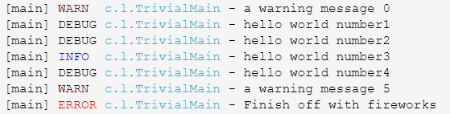

# 转换符符详解

[规则符官网说明](https://logback.qos.ch/manual/layouts.html#conversionWord)

## 什么是转换符？

转换符是日志输出的表示符！通过简略的表示符即可输出指定的日志格式等！

## 转换符

<table style="text-align:center">
	<tr>
		<th>转换符</th>
		<th>效果</th>
	</tr>
	<tr>
		<td>
			c{length}、lo{length}、logger{length}
		</td>
		<td>
			打印记录器名字（包类），如：<code>com.mingrn.logback.web.Index</code>，其中 <code>length</code> 为整数，这是记录器仅有的一个可选参数，写入该参数会通过一定的算法要输出的记录器的名称。看下面的栗子
			<table>
				<tr>
					<th>转换符说明</th>
					<th>类名</th>
					<th>结果</th>
				</tr>
				<tr>
					<td>%logger</td>
					<td>com.mingrn.logback.web.Index</td>
					<td>com.mingrn.logback.web.Index</td>
				</tr>
				<tr>
					<td>%logger{0}</td>
					<td>com.mingrn.logback.web.Index</td>
					<td>Index</td>
				</tr>
				<tr>
					<td>%logger{5}</td>
					<td>com.mingrn.logback.web.Index</td>
					<td>c.m.l.w.Index</td>
				</tr>
				<tr>
					<td>%logger{10}</td>
					<td>com.mingrn.logback.web.Index</td>
					<td>c.m.l.w.Index</td>
				</tr>
				<tr>
					<td>%logger{15}</td>
					<td>com.mingrn.logback.web.Index</td>
					<td>c.m.l.web.Index</td>
				</tr>
				<tr>
					<td>%logger{16}</td>
					<td>com.mingrn.logback.web.Index</td>
					<td>c.mingtn.logback.web.Index</td>
				</tr>
				<tr>
					<td>%logger{26}</td>
					<td>com.mingrn.logback.web.Index</td>
					<td>com.mingrn.logback.web.Index</td>
				</tr>
			</table>
		</td>
	</tr>
	<tr>
		<td>C{length}、class{length}</td>
		<td>同logger{length}</td>
	</tr>
	<tr>
		<td>contextName、cn</td>
		<td>输出<code>contextName标签</code>定义的名称</td>
	</tr>
	<tr>
		<td>d{pattern}、date{pattern}、d{pattern,timezone}、date{pattern,timezone}</td>
		<td>
		pattern是个日期格式化参数，就是 <code>java.text.SimpleDateFormat</code>
			<table>
				<tr>
					<th>转换符</th>
					<th>结果</th>
				</tr>
				<tr>
					<td>%d</td>
					<td>2018-06-05 06:06:06,222</td>
				</tr>
				<tr>
					<td>%date</td>
					<td>2018-06-05 06:06:06,222</td>
				</tr>
				<tr>
					<td>%date{ISO8601}</td>
					<td>2018-06-05 06:06:06,222</td>
				</tr>
				<tr>
					<td>%date{HH:mm:ss.SSS}</td>
					<td>06:06:06.222</td>
				</tr>
			</table>
		</td>
	</tr>
	<tr>
		<td>F、file</td>
		<td>输出日志请求发出的Java源文件的文件名。生成文件信息并不是特别快。因此，除非执行速度不是问题，否则应该避免使用它。</td>
	</tr>
	<tr>
		<td> caller{depth} 、caller{depthStart..depthEnd}、 caller{depth, evaluator-1, ... evaluator-n} 、caller{depthStart..depthEnd, evaluator-1, ... evaluator-n}</td>
		<td>输出发出日志事件的调用者的位置信息。位置信息依赖于JVM实现，但通常由调用方法的完全限定名称、调用者的源、文件名和括号之间的行号组成。一个整数可以被添加到调用者转换指定者的选项中，以配置要显示的信息的深度。</td>
	</tr>
	<tr>
		<td>L / line</td>
		<td>输出日志请求发出的行号。生成文件信息并不是特别快。因此，除非执行速度不是问题，否则应该避免使用它。</td>
	</tr>
	<tr>
		<td>m / msg / message</td>
		<td>输出与日志事件相关联的应用程序提供的消息。就是打印的日志</td>
	</tr>
	<tr>
		<td>n</td>
		<td>换行</td>
	</tr>
	<tr>
		<td>p / le / level</td>
		<td>输出日志事件的级别。如：info、debug。。。</td>
	</tr>
	<tr>
		<td>r / relative</td>
		<td>输出自应用程序开始以来的毫秒数，直到创建日志事件为止。</td>
	</tr>
	<tr>
		<td>t / thread</td>
		<td>输出线程名</td>
	</tr>
	<tr>
		<td>X{key:-defaultVal} 、
mdc{key:-defaultVal} </td>
		<td>输出MDC（映射诊断上下文）与产生日志事件的线程相关联。</td>
	</tr>
	<tr>
		<td>ex{depth} 、
exception{depth} 、
throwable{depth} 、
ex{depth, evaluator-1, ..., evaluator-n} 、
exception{depth, evaluator-1, ..., evaluator-n}、
throwable{depth, evaluator-1, ..., evaluator-n}</td>
		<td>输出与事件相关的异常的堆栈跟踪，如果有的话。默认情况下，输出完整的堆栈跟踪将信息。它可以使用一个转换词，如 short：输出第一行堆栈信息 ；  full：输出完整的堆栈信息； Any  integer： 输出指定行号堆栈信息；举个栗子：
			<table>
				<tr>
					<th>转换符</th>
					<th>结果</th>
				</tr>
				<tr>
					<td>%ex</td>
					<td><code>mainPackage.foo.bar.TestException: Houston we have a problem
  at mainPackage.foo.bar.TestThrower.fire(TestThrower.java:22)
  at mainPackage.foo.bar.TestThrower.readyToLaunch(TestThrower.java:17)
  at mainPackage.ExceptionLauncher.main(ExceptionLauncher.java:38)</code></td>
				</tr>
				<tr>
					<td>%ex{short}</td>
					<td><code>mainPackage.foo.bar.TestException: Houston we have a problem
  at mainPackage.foo.bar.TestThrower.fire(TestThrower.java:22)</code></td>
				</tr>
				<tr>
					<td>%ex{full}</td>
					<td><code>mainPackage.foo.bar.TestException: Houston we have a problem
  at mainPackage.foo.bar.TestThrower.fire(TestThrower.java:22)
  at mainPackage.foo.bar.TestThrower.readyToLaunch(TestThrower.java:17)
  at mainPackage.ExceptionLauncher.main(ExceptionLauncher.java:38)</code></td>
				</tr>
				<tr>
					<td>%ex{2}</td>
					<td><code>mainPackage.foo.bar.TestException: Houston we have a problem
  at mainPackage.foo.bar.TestThrower.fire(TestThrower.java:22)
  at mainPackage.foo.bar.TestThrower.readyToLaunch(TestThrower.java:17)</code></td>
				</tr>
			</table>
	</tr>
	<tr>
		<td>xEx{depth} 、
xException{depth} 、
xThrowable{depth} 、
xEx{depth, evaluator-1, ..., evaluator-n} 、
xException{depth, evaluator-1, ..., evaluator-n} 、
xThrowable{depth, evaluator-1, ..., evaluator-n}</td>
		<td>同<code>%throwable</code></td>
	</tr>
	<tr>
		<td> property{key}</td>
		<td>输出与名为key的属性相关联的值。关于如何定义离子的相关文档定义变量和变量范围。如果key不是logger上下文的属性，那么key将在系统属性中查找。</td>
	</tr>
	<tr>
		<td>replace(p){r, t}</td>
		<td>替换“r”，一个正则表达式，它在字符串中替换“t”，由子模式“p”产生。例如，“%替换（%msg）'s'”将删除事件消息中包含的所有空格。</td>
	</tr>
	<tr>
		<td>marker</td>
		<td>只输出与日志相关联带标记的日志信息</td>
	</tr>
</table>

## %具有特殊意义

 [%官网说明](https://logback.qos.ch/manual/layouts.html#percentIsSpecial)

 我们在写 `pattern` 规则的时候，需要在每个规则符前面加上 `%`。但实际中，笔者希望能够在控制台上打印 `%`，那就需要通过 `\`进行转义了。举个栗子：

```xml
<appender name="INFO" class="ch.qos.logback.core.ConsoleAppender">
	<encoder>
		<pattern>%d{yyyy-MM-dd HH:mm:ss,SSS} - %p \% -%msg%n</pattern>
	</encoder>
</appender>
```

 这个栗子中 要求它在控制台输出日志时要在 日志级别 与 日志内容之间 打印一个 `%`

## 转换符后对文字的限定

 [转换符后文字限定官网说明](https://logback.qos.ch/manual/layouts.html#restrictionsOnLiterals)

有时我们需要在转换符之后限定自定义的文字，如 `%data%nHello`。笔者的本意是在输出日期后换行说出 `Hello` 字面量，但实际上虽然 logback 不知道 `%nHello` 是什么，但依然 会自作聪明的认为是 `%data` 和 `%nHello`，出现的结果就是输出 `%PARSER_ERROR[nHello]` 。

所以，如果需要输出指定字符需要借助占位符 `{}` 来指定。举个栗子

```xml
<appender name="INFO" class="ch.qos.logback.core.ConsoleAppender">
	<encoder>
		<pattern>%d{yyyy-MM-dd HH:mm:ss,SSS} - %p -%msg%n{}HelloWorld</pattern>
	</encoder>
</appender>
```

这个栗子中再控制台输入日志时就会换行输出字面量 `HelloWorld`。

## 格式修改器

 [格式修改器官网说明](https://logback.qos.ch/manual/layouts.html#formatModifiers)

默认情况下，日志是输出全部信息的。可能有些日志词组比较长，觉得不够美观，那我们可以通过格式限定进行输出指定长度或有意义的字符。

格式限定有些可选字符，这些字符主要放置在 `%` 与规则符之间。

> **可选字符**
 - `-`：表示左对齐
 -  `十进制常量`：表示输出最小字符

|格式修改器	|左对齐	|最小宽度	|最大宽度	|说明	|
|:----------|------:|:----------|:----------|:-----:|
|%20logger	|false	|20	|none	|如果日志记录器的名称不超过20个字符长，则带有空格。|
|%-20logger	|true	|20	|none	|如果日志记录器的名称小于20个字符长，则使用空格。|
|%.30logger	|NA	|none	|30	|如果记录器的名称长于30个字符，则从一开始就截断。	|
|%20.30logger	|false	|20	|30	|如果日志记录器的名称短于20个字符，则留下空格。但是，如果logger名称大于30个字符，那么从一开始就截断。|
|%-20.30logger	|true	|20	|30	|如果日志记录器的名称短于20个字符，就可以使用空格。但是，如果logger名称大于30个字符，那么从一开始就截断。|
|%.-30logger	|NA	|none	|30	|如果记录器的名称长于30个字符，则从末端截断。|

> **详细示例请阅读官网**


## 单字符输出

 [单字符输出官网说明](https://logback.qos.ch/manual/layouts.html#oneLetterLevel)

 在输出日志级别 `TRACE`、 `DEBUG`、`WARN`、 `INFO` 、`ERROR` 你可能只想输出一个单字符 `T` 、`D`、 `W`、 `I`、 `E` 而单独的写了一个自定义的转换器，或者简单的使用格式修饰符！

 那你大可不必，因为你可知直接使用 `%.-1level` 即可！

## 小括号的使用

 [小括号官网说明](https://logback.qos.ch/manual/layouts.html#Parentheses)

小括号在正则表达式中的意思是模式的意思，啥？你不懂正则？没事，来给你推荐一个正则教程 [翟永超正则教程](http://blog.didispace.com/regular-expression-all/)。该教程三天包教会，笔者看完大牛的正则结束后一切都豁然开朗了。

 来，我们看下正则正则表达式

 `^20[\d]{2}-(0[1-9]|1[012])-(0[1-9]|[12][\d]|3[01])( ([01][\d]|2[0-3]):[0-5][\d]:[0-5][\d])?$`

 会正则的一眼就能看出来这是个判断日期的正则表达式，意思是
 匹配日期格式为 `yyyy-MM-dd` 或为 `yyyy-MM-dd HH:mm:ss` 的日期字符串，能这样做的原因就是因为 `()` 启的作用。具体为什么不多结束，不知道的看下翟的教程就好。

下面再来看下`()`在logback中的应用。

 **示例**

`%-30(%d{HH:mm:ss.SSS} [%thread]) %-5level %logger{32} - %msg%n`

小括号起的作用就是将 日期和线程 做了分组。因为，如果输入的日志字符少于30个字符就会被用空格符右填充。

*不用 `%-30()` 示例*

```vim
13:09:30 [main] DEBUG c.q.logback.demo.ContextListener - Classload hashcode is 13995234
13:09:30 [main] DEBUG c.q.logback.demo.ContextListener - Initializing for ServletContext
13:09:30 [main] DEBUG c.q.logback.demo.ContextListener - Trying platform Mbean server
13:09:30 [pool-1-thread-1] INFO  ch.qos.logback.demo.LoggingTask - Howdydy-diddly-ho - 0
13:09:38 [btpool0-7] INFO c.q.l.demo.lottery.LotteryAction - Number: 50 was tried.
13:09:40 [btpool0-7] INFO c.q.l.d.prime.NumberCruncherImpl - Beginning to factor.
13:09:40 [btpool0-7] DEBUG c.q.l.d.prime.NumberCruncherImpl - Trying 2 as a factor.
13:09:40 [btpool0-7] INFO c.q.l.d.prime.NumberCruncherImpl - Found factor 2
```

*用过之后的示例*

```vim
13:09:30 [main]            DEBUG c.q.logback.demo.ContextListener - Classload hashcode is 13995234
13:09:30 [main]            DEBUG c.q.logback.demo.ContextListener - Initializing for ServletContext
13:09:30 [main]            DEBUG c.q.logback.demo.ContextListener - Trying platform Mbean server
13:09:30 [pool-1-thread-1] INFO  ch.qos.logback.demo.LoggingTask - Howdydy-diddly-ho - 0
13:09:38 [btpool0-7]       INFO  c.q.l.demo.lottery.LotteryAction - Number: 50 was tried.
13:09:40 [btpool0-7]       INFO  c.q.l.d.prime.NumberCruncherImpl - Beginning to factor.
13:09:40 [btpool0-7]       DEBUG c.q.l.d.prime.NumberCruncherImpl - Trying 2 as a factor.
13:09:40 [btpool0-7]       INFO  c.q.l.d.prime.NumberCruncherImpl - Found factor 2
```

## 日志颜色值

 [日志颜色值官网说明](https://logback.qos.ch/manual/layouts.html#coloring)

在前面讲了小括号的使用。其实要在控制台输出日志带有颜色就需要借助小括号。在 `logback v1.0.5` 之后支持日下几种颜色。

- `%black`
- `%red`
- `%green`
- `%yellow`
- `%blue`
- `%magenta`
- `%cyan`
- `%white`
- `%gray`
- `%boldRed`
- `%boldGreen`
- `%boldYellow`
- `%boldBlue`
- `%boldMagenta`
- `%boldCyan`
- `%boldWhite`
- `%highlight`

**注意**如果你的计算机是windows系统需要先开启 `ANSI` 的支持，否则即使设置了颜色值也不会输出任何颜色！

 *看个栗子*

```xml
View as .groovy
<configuration debug="true">
  <appender name="STDOUT" class="ch.qos.logback.core.ConsoleAppender">
    <!-- windows 下需要开启对 ANSI 的支持,Linux 和 Mac 默认提供支持 -->
    <withJansi>true</withJansi>
    <encoder>
      <pattern>[%thread] %highlight(%-5level) %cyan(%logger{15}) - %msg %n</pattern>
    </encoder>
  </appender>
  <root level="DEBUG">
    <appender-ref ref="STDOUT" />
  </root>
</configuration>
```

输出的日志如下



## Evaluators

 [Evaluators官网说明](https://logback.qos.ch/manual/layouts.html#Evaluators)

`Evaluators` 相当于是一个判定，通过设定一个表达式可以大于日志进行过滤。比如：要求输出的日志包含特定字符时对日志进行格式化等。关于过滤规则表达式会在 **Filters** 章节进行详细讲解。这里只是提下，看下面的一个小栗子：

```xml
<configuration>
  <evaluator name="DISP_CALLER_EVAL">
    <expression>logger.contains("com.mingrn") &amp;&amp; \
      message.contains("who calls thee")</expression>
  </evaluator>

  <appender name="STDOUT" class="ch.qos.logback.core.ConsoleAppender">
    <encoder>
      <pattern>
        %-4relative [%thread] %-5level - %msg%n%caller{2, DISP_CALLER_EVAL}
      </pattern>
    </encoder>
  </appender>

  <root level="DEBUG">
    <appender-ref ref="STDOUT" />
  </root>
</configuration>
```

当发出日志请求时，会对相应的日志事件进行评估。**当调用者的包类包含 com.mingrn 并且日志信息包含  "who calls thee" 时将调用者数据显示出来**

现在我们创建一个java类 `CallerEvaluatorExample ` 包路径是 `com.mingrn`

```java
package com.mingrn;

import org.slf4j.Logger;
import org.slf4j.LoggerFactory;

import ch.qos.logback.classic.LoggerContext;
import ch.qos.logback.classic.joran.JoranConfigurator;
import ch.qos.logback.core.joran.spi.JoranException;
import ch.qos.logback.core.util.StatusPrinter;

public class CallerEvaluatorExample {

  public static void main(String[] args)  {
    Logger logger = LoggerFactory.getLogger(CallerEvaluatorExample.class);
    LoggerContext lc = (LoggerContext) LoggerFactory.getILoggerFactory();

    try {
      JoranConfigurator configurator = new JoranConfigurator();
      configurator.setContext(lc);
      configurator.doConfigure(args[0]);
    } catch (JoranException je) {
      // StatusPrinter will handle this
    }
    StatusPrinter.printInCaseOfErrorsOrWarnings(lc);

    for (int i = 0; i < 5; i++) {
      if (i == 3) {
        logger.debug("who calls thee?");
      } else {
        logger.debug("I know me " + i);
      }
    }
  }
}
```

*输出日志如下*：

```vim
0    [main] DEBUG - I know me 0
0    [main] DEBUG - I know me 1
0    [main] DEBUG - I know me 2
0    [main] DEBUG - who calls thee?
Caller+0   at chapters.layouts.CallerEvaluatorExample.main(CallerEvaluatorExample.java:28)
0    [main] DEBUG - I know me 4
```
